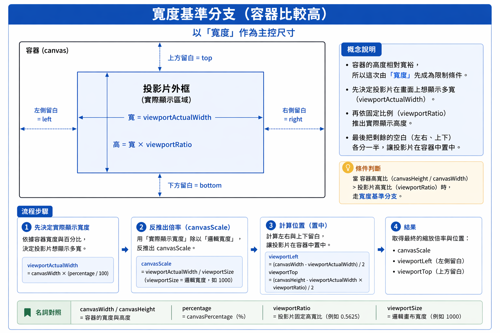
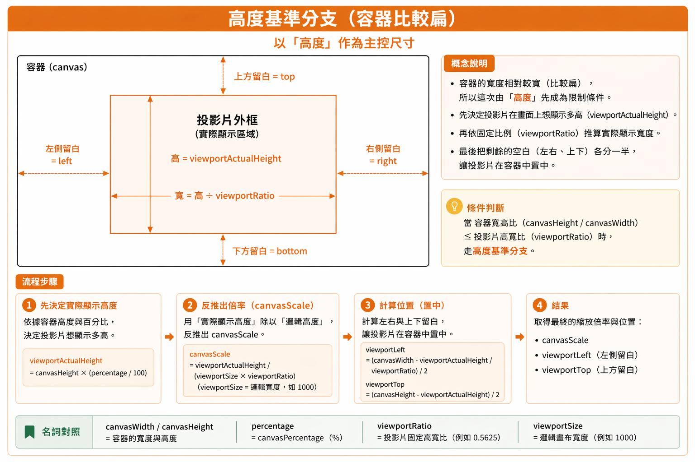

# `PPTist` 畫布縮放鏈路篇（`canvasScale` 的計算、重算與更新流）

所屬章節：[03-畫布系統](./README.md)

---

## 這篇要解決什麼

前面幾篇筆記已經把三件核心事情講清楚了：

1. 為什麼系統要先固定一張邏輯畫布
2. 為什麼顯示尺寸和資料尺寸不能混在一起看
3. 為什麼滑鼠事件最後要換回邏輯座標

但當你真正開始對照 `PPTist` 原始碼時，還會卡在另一個更具體的問題：

> `canvasScale` 到底是怎麼被算出來、什麼時候會重算、改了之後又會往哪裡傳？

所以這篇要處理的，不只是：

> `canvasScale` 的公式是什麼？

而是整條完整鏈路：

```text
邏輯畫布基準
-> 顯示目標（canvasPercentage）
-> useViewportSize.ts 算出 canvasScale
-> main store 保存 canvasScale
-> Canvas/index.vue 用它決定 wrapper 占位與 viewport 視覺縮放
-> 互動邏輯再用它把畫面座標換回邏輯座標
```

---

## 先說清楚：這一版筆記的對照基準

主要對照這幾個位置：

```text
doc/Canvas.md
src/store/slides.ts
src/store/main.ts
src/hooks/useScaleCanvas.ts
src/views/Editor/Canvas/hooks/useViewportSize.ts
src/views/Editor/Canvas/index.vue
```

這樣做的目的，是把這篇從「概念正確」再推進一步，改成：

> **不只觀念對，而且大部分關鍵句都能直接對回目前 source 的責任分工。**

---

## 先抓一句話核心

`canvasScale` 不是一個孤立的縮放數字，而是：

> **固定邏輯畫布映射到目前容器時的結果倍率。**

它夾在整個畫布系統的中間：

* 前面接的是 **邏輯畫布基準 + 容器尺寸 + 顯示目標**
* 後面接的是 **畫布占位 + 內容縮放 + 互動換算**

只要這個值改了，整張投影片在畫面上看起來多大、佔哪裡、互動怎麼換算，都會跟著一起變。

---

## 先把 4 個角色釘死

這篇最容易混掉的就是下面四個值。

### 1. `viewportSize`

邏輯畫布的寬度基準。

### 2. `viewportRatio`

邏輯畫布的高寬比。

### 3. `canvasPercentage`

顯示目標值。
它表示的是：

> 這次希望投影片大概占外層容器多少比例。

### 4. `canvasScale`

真正的縮放結果值。
它回答的是：

> 這張固定邏輯畫布，最後到底要縮放幾倍，才會在目前容器裡顯示成我要的大小？

如果這四個角色沒有先分開，後面你看到 `watch(canvasPercentage, ...)`、`setCanvasScale(...)`、`transform: scale(...)` 時，就很容易全混成同一層。

---

## 先看最短鏈路

先把整套東西壓成最短版本：

```text
viewportSize / viewportRatio
+ canvasWidth / canvasHeight
+ canvasPercentage
-> useViewportSize.ts 算出 canvasScale
-> mainStore.setCanvasScale(...)
-> Canvas/index.vue 讀取 canvasScale
-> viewport-wrapper 寬高更新
-> viewport 視覺縮放更新
-> 互動公式的除數更新
```

你如果能先把這條背熟，後面讀碼時就不會散掉。

---

# 一、為什麼系統需要 `canvasScale`

## 先講原理

`PPTist` 不會讓元素直接跟著目前 DOM 顯示尺寸跑。

它先固定一張邏輯畫布，讓所有元素資料都活在同一套固定座標系裡；
之後才根據目前外層容器有多大，決定這張邏輯畫布現在應該顯示成多大。

這時候系統就一定需要一個中介值，去回答下面這個問題：

> **這張固定邏輯尺寸的畫布，現在到底要縮放幾倍，才會變成畫面上看到的大小？**

這個中介值就是 `canvasScale`。

所以 `canvasScale` 真正解的，不是某個元素要放大幾倍，
而是：

> **整張邏輯畫布，現在要用幾倍顯示，才能對應到目前這個容器。**

你也可以把它理解成一條橋：

```text
邏輯畫布尺寸
-> canvasScale
-> 畫面上的實際顯示尺寸
```

如果沒有這個倍率，系統會立刻少掉一個很重要的中介層：

* `viewport` 不知道整張內容該縮放幾倍
* `viewport-wrapper` 不知道畫面上應該占多少寬高
* 滑鼠事件拿到的畫面距離，也沒辦法穩定換回邏輯座標

所以更精準地說：

* 邏輯畫布負責 **讓資料基準固定**
* `canvasScale` 負責 **把固定邏輯尺寸轉成目前畫面尺寸**
* 互動系統再用同一個 `canvasScale`，把畫面座標換回邏輯座標

這也是為什麼 `canvasScale` 會是整個畫布顯示與互動鏈路的中樞倍率。

---

## 再對回 Source

在 `slides.ts` 裡，邏輯畫布基準是：

```ts
viewportSize: 1000
viewportRatio: 0.5625
```

所以邏輯畫布就是：

```ts
width = 1000
height = 1000 * 0.5625 = 562.5
```

這組值定義的是：

> **資料世界裡，投影片本來有多大。**

而在 `main.ts` 裡，另外保存了畫布顯示相關狀態：

```ts
canvasPercentage: 90
canvasScale: 1
canvasDragged: false
```

這裡其實已經把兩層切開了：

* `slides.ts`：定義固定邏輯畫布
* `main.ts`：保存目前顯示策略與顯示結果

其中：

* `canvasPercentage` 是顯示目標，表示希望畫布大約占容器幾成
* `canvasScale` 是換算結果，表示邏輯畫布最後要縮放幾倍

也就是說，`PPTist` 不是直接把 DOM 目前寬高拿來當資料基準，
而是先有固定邏輯畫布，再用 `canvasScale` 把它映射到畫面上。

---

# 二、為什麼 `canvasScale` 不可能只靠單一輸入決定

## 先講原理

`canvasScale` 之所以不會是一個固定值，也不是因為「原始碼剛好用了很多變數」，
而是因為它天生就在解一個**雙邊對接**的問題：

> **一邊是固定不變的邏輯畫布，另一邊是隨時可能改變的顯示環境。**
> **`canvasScale` 的工作，就是把這兩邊接起來。**

所以只要先想清楚它在接哪兩邊，你就會知道它不可能只靠單一輸入決定。

---

### 第一邊：資料世界必須穩定

在 `PPTist` 裡，元素資料不能直接綁在當前螢幕尺寸上。

因為如果資料直接跟著畫面大小跑，馬上會出現幾個問題：

* 同一個元素在不同視窗大小下，座標意義會改變
* 拖曳、縮放、框選之後，很難穩定寫回資料
* 主編輯區、縮圖、播放頁之間，不容易共用同一套元素資料

所以系統一定要先固定一張邏輯畫布，
讓所有元素都活在同一套穩定座標系裡。

這代表一件事：

> **畫布原本有多大，不是由現在畫面決定，而是由邏輯基準決定。**

這就是 `viewportSize`、`viewportRatio` 存在的理由。

它們不是只是「兩個變數」而已，
而是在保證：

> **資料世界先獨立成立。**

---

### 第二邊：顯示世界一定會變動

但資料世界穩定，不代表畫面世界也穩定。

使用者真正看到的編輯區，會一直變：

* 視窗大小會改
* 側邊欄展開收合，容器可用空間會改
* 使用者手動放大、縮小畫布時，顯示目標會改

也就是說：

> **同一張邏輯畫布，永遠不會只有一種固定顯示方式。**

它今天可能在大螢幕裡顯示成 1400px 寬，
明天也可能在較窄容器裡只顯示成 900px 寬。

所以系統還必須知道另一件事：

> **這張邏輯畫布，這一次在目前容器裡，想顯示成多大？**

這就是容器尺寸與 `canvasPercentage` 存在的理由。

---

### 為什麼不能只靠邏輯畫布基準？

如果只看：

```text
viewportSize
viewportRatio
```

你只能知道：

> 這張畫布在資料世界裡本來有多大

但你完全不知道：

* 現在外層容器有多大
* 這次可用空間是寬受限還是高受限
* 使用者想讓它占容器幾成

也就是說，你只能知道「原稿大小」，
卻不知道「現在要印成多大張」。

所以只靠邏輯畫布基準，不可能推出 `canvasScale`。

---

### 為什麼不能只靠容器尺寸？

反過來，如果只看：

```text
canvasWidth
canvasHeight
```

你只能知道：

> 現在畫面可用空間有多大

但你還是不知道：

* 這張投影片邏輯上本來多大
* 它原本的比例是什麼
* 現在這個容器裡，到底該用寬度當基準，還是高度當基準

更重要的是：

> **如果沒有固定邏輯畫布基準，元素資料的座標意義就會跟著顯示尺寸漂移。**

這會讓整個編輯器失去穩定的資料基準。

所以只靠容器尺寸，也不可能推出正確的 `canvasScale`。

---

### 為什麼不能只靠 `canvasPercentage`？

這個點最容易被忽略。

很多人會直覺覺得：

> 不是已經有 `canvasPercentage` 了嗎？
> 那直接拿它當縮放倍率不就好了？

不行，因為 `canvasPercentage` 表示的是：

> **希望畫布大約占容器幾成**

它表達的是**顯示意圖**，不是最後倍率。

例如同樣都是：

```text
canvasPercentage = 90
```

如果容器寬度不同，最後實際顯示寬度就不同；
而實際顯示寬度不同，推回來的 `canvasScale` 當然也不同。

所以：

> `canvasPercentage` 只能告訴系統「想顯示多大」
> 但不能單獨告訴系統「最後到底要縮幾倍」

這也是為什麼 `PPTist` 沒有把使用者操作直接寫成固定 `canvasScale`，
而是先保存「顯示目標」，再重新換算真正倍率。

這樣設計的好處是：

* 容器尺寸一改，系統可以重算
* 但使用者的縮放意圖可以保留
* 同樣的「想占 90%」可以在不同容器裡自動轉成對應倍率

這比直接硬存某個固定倍率穩定很多。

---

### 所以 `canvasScale` 為什麼一定同時看多組條件？

因為它不是單純的設定值，而是：

> **把固定資料世界，映射到當前顯示世界時的中介結果。**

所以它一定同時需要：

#### 1. 邏輯畫布基準

用來知道：

> 這張畫布在資料世界裡本來有多大

#### 2. 外層容器尺寸

用來知道：

> 現在畫面最多能容納多大

#### 3. 顯示目標

用來知道：

> 這次不是要塞滿整個容器，而是想顯示到幾成

也就是說，`canvasScale` 真正解的不是「某個值要不要變」，
而是：

> **固定邏輯畫布，在目前這個容器裡、依照這次顯示策略，最後應該用幾倍呈現。**

---

### 這裡其實還藏著一個更深的設計原因

`canvasScale` 必須依賴 `viewportRatio`，
不只是因為邏輯高度要靠它算出來而已。

更深一層的原因是：

> **投影片比例是固定的，但容器比例是不固定的。**

所以每次重算時，系統都必須先判斷：

* 這次是寬度先成為限制
* 還是高度先成為限制

這不是多做一步而已，
而是固定比例內容要放進任意比例容器時，必然要面對的問題。

也就是說，`viewportRatio` 不是附帶資訊，
而是整個「該走哪條縮放路徑」的判斷基礎。

---

## 再對回 Source

在 `slides.ts` 裡，store 先提供固定邏輯畫布基準：

```ts
viewportSize: 1000
viewportRatio: 0.5625
```

這一層定義的是：

> 畫布本體在資料世界裡的基準尺寸與比例。

而在 `main.ts` 裡，則另外保存：

```ts
canvasPercentage: 90
canvasScale: 1
canvasDragged: false
```

其中真正和這一節主題直接相關的，是前兩個：

* `canvasPercentage`：顯示目標
* `canvasScale`：換算結果

再到 `useViewportSize.ts` 裡，
系統會讀取：

* `viewportSize`
* `viewportRatio`
* `canvasPercentage`
* `canvasRef.value.clientWidth`
* `canvasRef.value.clientHeight`

先判斷容器比例和投影片比例的關係，
決定這次走「寬度基準」還是「高度基準」，
再把「想顯示的實際尺寸」除以「邏輯尺寸」，
最後推回 `canvasScale`。

所以從 source 角度看，這個設計不是剛好拆成三組變數而已，
而是因為系統本來就在做這件事：

```text
固定邏輯畫布
+ 當前容器條件
+ 使用者顯示目標
-> 推回這次真正的 canvasScale
```

---

# 三、`canvasScale` 是怎麼算出來的

## 先講原理

`canvasScale` 不是先憑空指定一個倍率，
再拿這個倍率去套畫布。

更貼近實際設計的說法是：

> **系統會先決定：這張固定比例的投影片，這次在目前容器裡，最多該顯示成多大；**
> **然後再把這個「實際顯示尺寸」反推回倍率。**

所以整個思路不是：

```text
先有倍率
-> 再決定畫面多大
```

而是：

```text
先決定這次畫面想顯示多大
-> 再反推出倍率
```

這樣設計不是繞路，而是因為 `PPTist` 要處理的是：

> **一張固定比例的投影片，要放進一個比例不固定的容器裡。**

只要是這種情況，系統就一定得先回答下面這個問題：

> **這次到底是寬度先成為限制，還是高度先成為限制？**

因為如果判斷錯了，就會出現兩種問題：

* 不是超出容器
* 就是畫面空間利用不合理

所以第一步其實不是在「選公式」，
而是在判斷：

> **這次該用哪一邊當作縮放基準，才能讓固定比例內容正確放進容器。**

---

### 第一步：先判斷這次是寬度受限，還是高度受限

投影片本身的比例是固定的。

例如在 PPTist 裡，邏輯畫布比例固定是：

```text
1000 : 562.5
```

也就是：

```text
viewportRatio = 0.5625
```

但外層容器比例不是固定的。

有時候容器比較高，
有時候容器比較扁。

所以系統要先比較：

* **容器目前的高寬比**
* **投影片固定的高寬比**

本質上是在問：

> **容器相對於投影片來說，是比較高，還是比較扁？**

如果容器比投影片更高，代表高度空間相對寬裕，
這時比較容易先受限的是**寬度**。

如果容器比投影片更扁，代表垂直空間比較緊，
這時比較容易先受限的是**高度**。

所以這一步不是技巧，而是固定比例內容進容器時一定要做的判斷。

---

### 第二步：先算這次投影片在畫面上想顯示多大

這一步也很重要。

系統不是一上來就算 `canvasScale`，
而是先決定：

> **這次投影片在畫面上，想顯示成多寬或多高。**

為什麼要這樣？

因為 `canvasScale` 本質上只是一個換算倍率，
它本身不能告訴你「這次應該顯示多大」。

真正決定「想顯示多大」的是：

* 容器目前尺寸
* `canvasPercentage`

也就是：

> **這次希望畫布大約占容器幾成空間**

所以如果這次走寬度基準，
系統就先算：

> 這次畫面上想顯示多寬

如果這次走高度基準，
系統就先算：

> 這次畫面上想顯示多高

也就是說，這一步先得到的是：

```text
實際顯示尺寸
```

而不是倍率。

---

### 第三步：再把顯示尺寸換回倍率

等「實際想顯示多大」確定後，
`canvasScale` 就很好理解了。

它本質上只是：

```text
實際想顯示的尺寸 ÷ 邏輯尺寸
```

如果這次走寬度基準，那就是：

```text
canvasScale = 實際顯示寬度 ÷ 邏輯寬度
```

如果這次走高度基準，那就是：

```text
canvasScale = 實際顯示高度 ÷ 邏輯高度
```

所以 `canvasScale` 不是「先決定的值」，
而是：

> **在這次容器條件下，為了讓投影片顯示成目標大小，而反推回來的結果。**

這也是為什麼它不能和 `canvasPercentage` 混成同一件事：

* `canvasPercentage` 是顯示目標
* `canvasScale` 是換算結果

---

### 第四步：位置其實是跟著顯示尺寸一起成立的

當系統已經知道：

* 這次投影片顯示多大
* 這次投影片應該縮放幾倍

接下來 `left / top` 其實就只是：

> **把剩下的空白平均分到兩邊，讓投影片置中**

所以 `viewportLeft / viewportTop` 並不是另一套獨立公式，
而是建立在前面「顯示尺寸已經確定」之後，自然推出來的結果。

也就是說，整個鏈路其實是：

```text
先判斷哪一邊受限
-> 先算這次畫面想顯示多大
-> 再反推 canvasScale
-> 最後用剩餘空白推回 left / top
```

這樣整段邏輯才會真的連起來。

---

## 再對回 Source

在 `useViewportSize.ts` 的 `initViewportPosition()` 裡，核心判斷是：

```ts
if (canvasHeight / canvasWidth > viewportRatio.value) {
  // 寬度基準
}
else {
  // 高度基準
}
```

這段不是隨便拆兩支，
而是在比較：

* `canvasHeight / canvasWidth`：容器目前的高寬比
* `viewportRatio.value`：投影片固定的高寬比

本質上就是在問：

> **容器相對於投影片來說，是更高，還是更扁？**

---

### 寬度基準分支

如果條件成立，代表容器比投影片更高，
這時候高度相對寬裕，所以由**寬度**先成為限制。

系統就會先算：

```ts
const viewportActualWidth = canvasWidth * (canvasPercentage.value / 100)
```

這行在解的不是倍率，
而是：

> **這次投影片在畫面上，想顯示成多寬。**

接著再用：

```ts
mainStore.setCanvasScale(viewportActualWidth / viewportSize.value)
```

把這個「實際顯示寬度」除以「邏輯寬度」，
反推出真正的 `canvasScale`。

也就是：

```ts
canvasScale = 實際顯示寬度 / 邏輯寬度
```

接著再由這個顯示寬度與固定比例，推出顯示高度，
最後把剩餘空白平均分到左右與上下：

```ts
viewportLeft.value = (canvasWidth - viewportActualWidth) / 2
viewportTop.value = (canvasHeight - viewportActualWidth * viewportRatio.value) / 2
```

所以寬度基準分支的完整思路可以壓成一句話：

> **先用寬度決定這次畫布顯示多大，再由這個顯示寬度反推出 `canvasScale`，最後把剩餘空白各分一半，讓畫布置中。**

#### 示意圖



---

### 高度基準分支

如果條件不成立，代表容器相對比較扁，
這時候垂直空間比較緊，所以由**高度**先成為限制。

系統就會先算：

```ts
const viewportActualHeight = canvasHeight * (canvasPercentage.value / 100)
```

這行先決定的是：

> **這次投影片在畫面上，想顯示成多高。**

接著再用：

```ts
mainStore.setCanvasScale(viewportActualHeight / (viewportSize.value * viewportRatio.value))
```

把「實際顯示高度」除以「邏輯高度」，
反推出真正的 `canvasScale`。

也就是：

```ts
canvasScale = 實際顯示高度 / 邏輯高度
```

接著再由這個顯示高度和固定比例，反推出顯示寬度，
最後把剩餘空白平均分到左右與上下：

```ts
viewportLeft.value = (canvasWidth - viewportActualHeight / viewportRatio.value) / 2
viewportTop.value = (canvasHeight - viewportActualHeight) / 2
```

所以高度基準分支的完整思路也可以壓成一句話：

> **先用高度決定這次畫布顯示多大，再由這個顯示高度反推出 `canvasScale`，最後把剩餘空白各分一半，讓畫布置中。**

#### 示意圖


---

# 四、為什麼 `canvasScale` 不直接等於 `canvasPercentage`

## 先講原理

這一點很容易誤會。

例如你看到：

```ts
canvasPercentage = 90
```

很容易直覺以為：

```ts
canvasScale = 0.9
```

但這其實不對，因為這兩個值雖然都和「畫布看起來多大」有關，卻不是同一層的東西。

更精準地說：

* `canvasPercentage` 解的是：

  > **我希望畫布大約占容器幾成空間？**
* `canvasScale` 解的是：

  > **在目前這個容器裡，這張固定邏輯畫布最後到底要縮放幾倍，才能顯示成剛剛那個目標大小？**

也就是說：

> **`canvasPercentage` 是顯示意圖，`canvasScale` 是意圖落地後的換算結果。**

這就是它們不能直接相等的根本原因。

---

### 為什麼不能直接把 `90` 看成 `0.9 倍`

因為 `90%` 這件事，本質上是在說：

> **畫布想占「容器」的 90%**

但 `0.9 倍` 這件事，本質上是在說：

> **邏輯畫布要縮放成原本的 0.9 倍**

這兩句話看起來很像，實際上卻不是同一件事。

原因在於：

* 前者的基準是 **容器**
* 後者的基準是 **邏輯畫布本身**

所以只要容器大小一變，
同樣的 `canvasPercentage = 90`，
最後換算出來的 `canvasScale` 就可能完全不同。

---

### 系統為什麼要故意把這兩者拆開

因為 `PPTist` 想保留的是：

> **使用者的縮放意圖要穩定，真正的顯示倍率則由系統依環境自動重算。**

這種拆法有一個很重要的好處：

#### `canvasPercentage` 保存的是「想看多大」

例如使用者連點放大，
本質上不是在說：

> 我要固定變成 `1.2 倍`

而比較像是在說：

> 我要讓畫布在目前視窗裡看起來再大一點

所以系統把這種意圖記在 `canvasPercentage`。

---

#### `canvasScale` 保存的是「現在實際要縮幾倍」

但畫布到底該縮幾倍，
不能只看使用者想看多大，
還要一起看：

* 容器現在多大
* 這次是寬度受限還是高度受限
* 投影片邏輯尺寸是多少

也就是說：

> **同一個顯示意圖，在不同容器裡，本來就應該對應到不同的 `canvasScale`。**

這也是為什麼系統不能直接把：

```ts
canvasPercentage = 90
```

硬翻成：

```ts
canvasScale = 0.9
```

因為那樣等於把「顯示意圖」誤當成「最終倍率」。

---

### 用一個例子就會很清楚

假設邏輯畫布寬度固定是：

```ts
viewportSize = 1000
```

現在：

```ts
canvasPercentage = 90
```

#### 情況 A：容器寬度是 `1200`

如果這次走寬度基準，先得到：

```ts
viewportActualWidth = 1200 * 0.9 = 1080
```

所以：

```ts
canvasScale = 1080 / 1000 = 1.08
```

---

#### 情況 B：容器寬度是 `800`

同樣是：

```ts
canvasPercentage = 90
```

但這次先得到：

```ts
viewportActualWidth = 800 * 0.9 = 720
```

所以：

```ts
canvasScale = 720 / 1000 = 0.72
```

你會發現：

* 兩次的 `canvasPercentage` 都是 `90`
* 但最後算出來的 `canvasScale` 一次是 `1.08`
* 另一次是 `0.72`

這就直接說明了一件事：

> **`canvasPercentage` 相同，不代表 `canvasScale` 也會相同。**

因為 `canvasPercentage` 只表達「想占容器多少」，
真正的 `canvasScale` 還要看容器條件和邏輯畫布基準。

---

### 更深一層看，兩者其實在不同責任層

你可以把它們直接記成：

#### `canvasPercentage`

偏向**互動層 / 意圖層**

它保存的是：

> 使用者想讓畫布看起來更大還是更小

---

#### `canvasScale`

偏向**顯示層 / 幾何結果層**

它保存的是：

> 系統依目前容器條件，實際算出來要用幾倍顯示

---

所以 `PPTist` 不是不想直接改 `canvasScale`，
而是它刻意把：

```text
使用者想要多大
```

和

```text
系統最後要縮幾倍
```

拆成兩層。

這樣做的好處是：

* 使用者意圖可以保留
* 容器變動時可以重算
* 同樣的縮放意圖能適應不同畫面大小
* 顯示結果不會被某個固定倍率綁死

---

## 再對回 Source

`useScaleCanvas.ts` 裡最關鍵的設計，不是直接設定 `canvasScale`，而是先調整 `canvasPercentage`，再交給後面的顯示計算流程去重算真正的倍率。你前面的筆記也已經整理到這一點：`scaleCanvas('+') / scaleCanvas('-')` 改的是 `canvasPercentage`，而不是直接硬塞 `canvasScale`；真正的倍率則要等 `useViewportSize.ts` 再根據容器條件與邏輯畫布基準推回來。

所以 `PPTist` 的思路不是：

> 我要直接把 `canvasScale` 改成 1.2

而是：

> 我要讓畫布在目前容器裡看起來更大或更小，
> 然後再根據容器尺寸、投影片比例、邏輯畫布大小，重新換算真正的 `canvasScale`。

這樣設計比較穩，因為畫布本來就不是活在固定容器裡；同一個顯示意圖，在不同容器中，本來就應該推回不同的倍率。 

---

# 五、要把「重算」和「更新」分開看

## 先講原理

這一節很重要，因為它直接決定你會不會把 `PPTist` 的縮放流程講錯。

很多人看到畫布大小變了，就會很習慣地用一句：

> `canvasScale` 變了，所以系統重算了畫布位置

把所有情況一起帶過。

但更貼近 `PPTist` 原始碼的說法其實不是這樣。
因為在目前的畫布系統裡，至少有兩種完全不同的情境：

---

### 第一種情境：系統需要重新建立一組合理的顯示結果

這種情況下，重點不是保留你剛剛那一瞬間的外框位置感，
而是要回答：

> **以目前這個容器、這個比例、這個邏輯尺寸來看，畫布現在應該顯示多大、放在哪裡，才是合理的？**

這條路比較像是：

* 第一次進來時，要先建立初始顯示狀態
* 容器大小改變後，要重新適配
* 投影片比例改變後，要重新適配
* 邏輯尺寸改變後，要重新適配
* 原本被拖走的畫布，需要回到系統認定的正常位置

這裡的核心不是「延續原本位置」，
而是：

> **重新根據目前條件，產生一組新的、合理的畫布尺寸與位置。**

所以這種情況比較適合叫：

> **重算**
> 或
> **初始化 / 重置型路徑**

---

### 第二種情境：系統要在目前外框基礎上，連續修正位置

另一種情況則不是重新建立一套初始結果，
而是畫布已經在畫面上了，
使用者現在只是想把它放大一點或縮小一點。

這時如果系統每次都直接重新置中，
畫面會有一種很明顯的「跳一下」的感覺。

因為使用者期待的是：

> **畫布在目前位置附近連續地變大 / 變小**

而不是：

> **每縮一次就被系統重新擺回某個預設位置**

所以這條路要解的問題其實是：

> **當畫布顯示尺寸改變時，如何在目前外框基礎上同步修正 `left / top`，讓縮放過程看起來穩定、連續，不會像被重設。**

這裡的核心不是重新找一組標準答案，
而是：

> **沿著目前狀態做增量修正。**

所以這種情況比較適合叫：

> **更新**
> 或
> **縮放時的增量更新路徑**

---

### 為什麼一定要把這兩條路分開

因為這兩種情境的目標根本不同。

#### 重算路徑要解的是：

> 現在整個畫布顯示條件變了，系統要重新給出一組合理結果。

#### 更新路徑要解的是：

> 顯示倍率正在變動，但畫布不應該看起來每次都被重設位置。

如果不把這兩者分開，
就很容易把所有情況都講成：

> **`canvasScale` 變了，所以系統重新置中**

但這樣其實不符合使用者實際看到的行為。

因為在縮放流程裡，`PPTist` 不是每次都把畫布重新擺回預設中心，
而是會根據新舊顯示尺寸的差值，
去同步修正外框位置，
讓縮放看起來是從當前狀態延續下去的。

所以這一節最重要的一句話應該是：

> **不是所有會改到 `canvasScale` 的流程，都應該叫「重算」。**
> **有些是重置型重算，有些是連續縮放下的位置更新。**

---

## 再對回 Source

在 `useViewportSize.ts` 裡，這兩條路其實就被拆成兩個函式。

### 1. `initViewportPosition()`

這個函式做的事情比較像：

> **重新依照目前條件，建立一組新的畫布顯示結果。**

它負責的不是只改倍率而已，
而是整套一起重建：

* 重新判斷這次是寬度基準還是高度基準
* 重新計算 `canvasScale`
* 重新計算顯示尺寸
* 重新給出置中的 `viewportLeft / viewportTop`

所以它不是在延續某個既有位置做微調，
而是在回答：

> **如果以現在這些條件重新開始，畫布應該怎麼放才合理？**

因此更貼近原始碼的說法是：

> **`initViewportPosition()` 比較像初始化 / 重置型路徑。**

---

### 2. `setViewportPosition(newValue, oldValue)`

這個函式做的事就不是重新建立初始位置了。

它的重點是：

* 比較新的 `canvasPercentage` 和舊的 `canvasPercentage`
* 算出新舊顯示尺寸的差值
* 再用差值的一半去修正 `viewportLeft / viewportTop`

也就是說，它不是在問：

> 現在最標準的位置在哪？

而是在問：

> **既然畫布剛剛還在這裡，現在尺寸變大或變小了，那外框位置要怎麼一起修，畫面看起來才會穩？**

寬度基準分支可以把它理解成：

```ts
viewportLeft -= (新顯示寬 - 舊顯示寬) / 2
viewportTop  -= (新顯示高 - 舊顯示高) / 2
```

高度基準分支本質上也是同一件事，
只是先由高度差值推回這次寬高變化。

所以更貼近原始碼的說法不是：

> 縮放時只是把倍率改掉

而是：

> **縮放時除了更新 `canvasScale`，還會根據新舊顯示尺寸差值，同步修正外框位置。**

---

## 這兩條路實際各自對應什麼情況

你可以直接把它們記成下面這樣。

### `initViewportPosition()` 比較像在處理：

* 首次建立畫布
* 容器尺寸改變
* `viewportRatio` 改變
* `viewportSize` 改變
* `canvasDragged` 被重置後，要回到正常位置

這些情況的共同點是：

> **系統要重新決定現在整張畫布應該怎麼顯示。**

---

### `setViewportPosition(newValue, oldValue)` 比較像在處理：

* 使用者放大畫布
* 使用者縮小畫布
* `canvasPercentage` 改變後，要在目前外框基礎上做連續修正

這些情況的共同點是：

> **畫布不是重新開始，而是在既有顯示狀態上繼續變化。**

---

# 六、`canvasScale` 到底什麼時候會重算

## 先講原理

這一節最容易講糊的地方是：看到 `canvasScale` 變了，就把所有情況都叫做「重算」。

但更貼近 `PPTist` 原始碼的說法其實是：

> **凡是影響畫布顯示條件的事件，都會觸發一條和 `canvasScale` 有關的計算鏈；**
> **只是這條計算鏈有兩種入口：一種是重置型重算，一種是增量型更新。** ([GitHub][1])

也就是說，這一節如果只寫成：

> `canvasScale` 什麼時候會重算

其實還不夠精準。
更準的理解應該是：

> **哪些事件會觸發 `canvasScale` 相關計算？**
> **而且它們是走「重置型路徑」還是「更新型路徑」？** ([GitHub][1])

---

### 先把兩種入口分清楚

#### 第一種：更新型入口

這條路對應的是：

> **畫布已經在畫面上了，現在只是顯示目標改變，所以系統要在目前外框基礎上，邊重算倍率、邊修正位置。**

這種情況不會把畫布整張重新當成「初次建立」那樣處理，
而是比較像：

> **沿著目前狀態做連續縮放。** 

---

#### 第二種：重置型入口

這條路對應的是：

> **畫布的顯示條件本身變了，所以系統要重新求出一組合理的尺寸與位置。**

這時重點不是延續剛剛那個位置感，
而是：

> **以目前條件重新建立一個合理的顯示結果。** 

---

所以這一節最重要的一句話，其實應該是：

> **`canvasScale` 會變，不代表每次都是同一種「重算」；**
> **有些是縮放時的增量更新，有些才是重置型重算。** 

---

## 再對回 Source

在 `useViewportSize.ts` 裡，和 `canvasScale` 相關的入口可以整理成 5 類；其中只有第 1 類走更新型入口，其餘幾類都比較接近重置型入口。

---

### 1. 顯示目標改變時：走更新型入口

`useViewportSize.ts` 直接寫了：

```ts
watch(canvasPercentage, setViewportPosition)
```

這表示只要 `canvasPercentage` 改了，系統就不會直接整張畫布「重新初始化」，
而是走 `setViewportPosition(newValue, oldValue)` 這條路。這條路裡面會重新計算 `canvasScale`，同時也根據新舊顯示尺寸差值去修正 `viewportLeft / viewportTop`，讓縮放看起來是沿著目前位置連續變化，而不是每次都跳回預設中心。

這也是為什麼像工具列放大 / 縮小、手動輸入縮放比例、以及 `resetCanvas()` 這些操作，最後都會先落到 `canvasPercentage`。因為在 `useScaleCanvas.ts` 裡，`scaleCanvas()`、`setCanvasScalePercentage()`、`resetCanvas()` 操作的重點都不是直接設定 `canvasScale`，而是先改 `canvasPercentage`，再交給 `useViewportSize.ts` 去算真正的倍率。

所以這一類情況，最精準的講法不是：

> `canvasScale` 被直接改掉了

而是：

> **顯示目標改了，因此系統走增量更新路徑，重新算 `canvasScale`，並同步修正外框位置。**

---

### 2. 邏輯畫布比例改變時：走重置型入口

`useViewportSize.ts` 也直接寫了：

```ts
watch(viewportRatio, initViewportPosition)
```

這表示只要投影片比例改變，系統就會重新走 `initViewportPosition()`。這條路會重新判斷本次是寬度基準還是高度基準，重新計算 `canvasScale`，並重新給出一組置中的 `viewportLeft / viewportTop`。因為比例一旦變了，原本那套顯示幾何關係就不再成立，所以這裡不是局部修正，而是重置型重算。

---

### 3. 邏輯畫布尺寸改變時：走重置型入口

同一個檔案裡還有：

```ts
watch(viewportSize, initViewportPosition)
```

這代表只要邏輯畫布基準尺寸改變，系統同樣會重新走 `initViewportPosition()`。原因很直接：`viewportSize` 改變，等於「邏輯世界裡這張投影片本來有多大」改了，那 `canvasScale = 實際顯示尺寸 ÷ 邏輯尺寸` 這個換算基礎也跟著改了，所以要整套重新建立。

---

### 4. 容器尺寸改變時：走重置型入口

`useViewportSize.ts` 裡建立了一個：

```ts
const resizeObserver = new ResizeObserver(initViewportPosition)
```

然後在 `onMounted()` 時去 `observe(canvasRef.value)`。這表示一旦畫布容器尺寸變動，入口就是 `ResizeObserver -> initViewportPosition()`。因此像編輯區尺寸改變、視窗改變造成 canvas 可用空間變化、或版面結構改動影響到 canvas 容器大小，本質上都會走這條重置型路徑。

這裡還有一個很值得寫清楚的細節：
**source 本身在 `onMounted()` 並沒有直接呼叫 `initViewportPosition()`；它做的是開始 observe。**
所以如果你要寫「初始化建立時」，更精準的說法應該不是：

> mounted 時直接重算

而是：

> **初始化建立後，系統透過 `ResizeObserver` 這條入口接住容器尺寸，進而進入 `initViewportPosition()`。** 

---

### 5. 拖曳狀態被復原時：走重置型入口

`useViewportSize.ts` 還有一條：

```ts
watch(canvasDragged, () => {
  if (!canvasDragged.value) initViewportPosition()
})
```

這條很值得單獨講，因為它代表：

* 畫布被拖曳後，狀態會被標記為 `true`
* 之後只要有某個流程把它設回 `false`
* 系統就會重新走 `initViewportPosition()`

所以這裡不是「拖曳時持續重算」，而是：

> **拖曳狀態復原時，系統把它當成一個明確的重置觸發點。** 

---

## 把 5 類時機整理成一句話

你可以把這一節直接壓成下面這張心智表：

| 事件                          | 入口                                         | 性質    |
| --------------------------- | ------------------------------------------ | ----- |
| `canvasPercentage` 改變       | `setViewportPosition()`                    | 增量更新  |
| `viewportRatio` 改變          | `initViewportPosition()`                   | 重置型重算 |
| `viewportSize` 改變           | `initViewportPosition()`                   | 重置型重算 |
| 容器尺寸改變                      | `ResizeObserver -> initViewportPosition()` | 重置型重算 |
| `canvasDragged` 復原為 `false` | `initViewportPosition()`                   | 重置型重算 |

這張表對目前 `useViewportSize.ts` 的結構是貼得上的：只有 `canvasPercentage` 這條 watcher 走更新型路徑，其餘幾條都是走 `initViewportPosition()` 這種重置型入口。

---

## 這一節最值得記住的一句話

你可以把這段直接記成：

> **`canvasScale` 相關計算的觸發時機可以分成兩類：**
> **`canvasPercentage` 改變時，走的是增量更新；**
> **比例、尺寸、容器、拖曳狀態改變時，走的是重置型重算。** 

---

# 七、使用者操作是怎麼把這條鏈路帶起來的

## 先講原理

如果只記「watcher 會觸發」，還是不夠具體。

更完整的理解應該是：

> **真正把這條鏈路帶起來的，通常不是某個神秘的自動事件，而是使用者操作先改了上游狀態。**

最常見的有三種：

1. 放大 / 縮小畫布
2. 重置畫布
3. 容器尺寸改變

---

## 再對回 Source

### 1. 滾輪 + Ctrl 縮放

在 `Canvas/index.vue` 裡，`handleMousewheelCanvas()` 會在 `ctrlKeyState` 成立時呼叫：

```ts
throttleScaleCanvas('+')
throttleScaleCanvas('-')
```

而 `throttleScaleCanvas` 來自 `useScaleCanvas()`。

所以這條線其實是：

```text
Ctrl + 滾輪
-> scaleCanvas('+/-')
-> setCanvasPercentage(...)
-> watch(canvasPercentage, setViewportPosition)
-> setCanvasScale(...)
-> 畫面更新
```

---

### 2. resetCanvas()

`useScaleCanvas.ts` 的 `resetCanvas()` 做了兩件事：

```ts
mainStore.setCanvasPercentage(90)
mainStore.setCanvasDragged(false)
```

這很重要，因為它不是自己直接改 `left / top`。
它是把工作交回 `useViewportSize.ts` 的兩條既有觸發線：

* `watch(canvasPercentage, setViewportPosition)`
* `watch(canvasDragged, ...)`

所以更貼近 source 的講法是：

> **重置畫布不是單點命令直接重設所有樣式，而是透過修改 store 狀態，讓 `useViewportSize.ts` 接手完成倍率與位置更新。**

---

### 3. 容器尺寸改變

這條線比較單純：

```text
canvasRef 尺寸變動
-> ResizeObserver(initViewportPosition)
-> 重算 canvasScale
-> 重算 viewportLeft / viewportTop
-> Canvas/index.vue 重新渲染
```

---

# 八、`canvasScale` 算出來之後，哪些地方會消費它

## 先講原理

`canvasScale` 存進 store 之後，不是只拿去做一個 CSS `scale()` 就結束了。

更精準地說，它至少同時服務三層：

1. 外框占位層
2. 內容縮放層
3. 互動換算層

所以這個值才會被看成畫布系統的中樞倍率。

---

## 再對回 Source

### 1. 外框占位層：`viewport-wrapper`

在 `Canvas/index.vue` 裡：

```ts
width: viewportStyles.width * canvasScale
height: viewportStyles.height * canvasScale
left: viewportStyles.left
top: viewportStyles.top
```

這代表：

* `viewportStyles.width / height` 仍然是邏輯尺寸
* 真正畫面上外框的顯示寬高，是到 wrapper 這層才乘上 `canvasScale`
* `left / top` 則直接使用目前定位值

也就是說：

> **wrapper 負責讓「縮放後的投影片外框」在畫面上真正成立。**

---

### 2. 內容縮放層：`viewport`

同一個檔案裡：

```ts
transform: scale(canvasScale)
```

這代表：

* 內容仍然站在固定邏輯畫布上渲染
* 視覺上的放大或縮小，發生在 `viewport` 這層

也就是：

> **wrapper 管外框占位，viewport 管內容縮放。**

---

### 3. 互動換算層：滑鼠座標回推邏輯座標

`Canvas/index.vue` 裡雙擊空白新增文字時，直接做了：

```ts
left = (e.pageX - viewportRect.x) / canvasScale
top  = (e.pageY - viewportRect.y) / canvasScale
```

而且連預設寬度也會除以 `canvasScale`：

```ts
width: 200 / canvasScale
```

這一段其實非常關鍵，因為它直接證明：

> **`canvasScale` 不只影響畫面長相，也影響互動資料最後怎麼寫回邏輯世界。**

---

### 4. 其他互動 hook 也在吃這個值

在 `Canvas/index.vue` setup 區域裡，很多 hook 都是直接把 `canvasScale` 傳進去的，例如：

* `useDragElement(..., canvasScale)`
* `useScaleElement(..., canvasScale)`
* `useRotateElement(..., viewportRef, canvasScale)`
* `useRotateGroupElement(..., viewportRef, canvasScale)`
* `useMoveShapeKeypoint(..., canvasScale)`

這代表它不是單一局部樣式值，而是整個互動層共用的換算基準。

---

# 九、`canvasScale` 為什麼適合放在 store

## 先講原理

當一個值同時會被：

* 顯示層使用
* 互動層使用
* 不同 hook 共享

那它就不再只是某個局部元件的私有狀態。

它比較像整個編輯器畫布系統的共享顯示狀態。

所以把 `canvasScale` 放在 store，不只是方便而已，而是符合它本來的角色。

---

## 再對回 Source

目前 source 裡，`canvasScale` 放在 `main.ts`，而 `Canvas/index.vue` 會直接 `storeToRefs(mainStore)` 取出它，再分發給：

* wrapper 的占位
* viewport 的視覺縮放
* 多個互動 hook
* 雙擊插字時的座標換算

所以更貼近原始碼的講法不是：

> `canvasScale` 被某個 hook 算出來之後順手存一下

而是：

> **`useViewportSize.ts` 只負責計算；真正的共享狀態中心在 `main.ts`。**

---

# 十、把整條鏈路壓成一張圖

## 先講原理

如果要把整篇濃縮成一張圖，你可以記下面這張：

```text
邏輯基準層
  viewportSize
  viewportRatio

輸入層
  canvasWidth / canvasHeight
  canvasPercentage

計算層
  useViewportSize.ts
  -> initViewportPosition() / setViewportPosition()
  -> setCanvasScale(...)

狀態層
  main.ts
  -> canvasScale

消費層
  Canvas/index.vue
  -> viewport-wrapper 用它決定外框占位
  -> viewport 用它做內容縮放

互動層
  dblclick / drag / scale / rotate / keypoint move
  -> 用它把畫面座標換回邏輯座標
```

這張圖最重要的，不是背名字，而是背出這個方向感：

> **先有邏輯畫布，再有顯示目標，再算出倍率，再把倍率分發給顯示與互動。**

---

## 再對回 Source

這張圖對回目前 source，可以直接對成：

* `slides.ts`：邏輯基準層
* `main.ts`：狀態層
* `useScaleCanvas.ts`：修改顯示目標的入口
* `useViewportSize.ts`：計算層
* `Canvas/index.vue`：消費層與互動層匯流處

---

# 十一、這篇和上一篇〈畫布定位篇〉的關係

## 先講原理

你可以把兩篇的分工這樣記：

### 畫布定位篇在解：

> 畫布外框現在放哪裡、看起來多大。

### 畫布縮放鏈路篇在解：

> 那個「看起來多大」的倍率，到底是怎麼被算出來、重算、更新、再分發出去的。

所以這兩篇不是平行重複，而是前後銜接：

```text
定位篇：外框結果長什麼樣
縮放鏈路篇：這個結果倍率是怎麼活起來的
```

---

## 再對回 Source

定位篇比較貼近：

* `viewportStyles`
* `viewport-wrapper`
* `left / top`

而這一篇比較貼近：

* `canvasPercentage`
* `setCanvasScale(...)`
* `watch(...)`
* `ResizeObserver(...)`
* `transform: scale(...)`

所以兩篇接起來之後，整個畫布系統才算真正完整。

---

# 十二、最容易混淆的 8 個點

### 1. `canvasScale` 不是邏輯畫布尺寸

它不會改 `viewportSize`，也不會改元素資料；它只決定這張畫布現在顯示成多大。

### 2. `canvasScale` 不是 `canvasPercentage`

前者是結果值，後者是顯示目標值。

### 3. `useScaleCanvas.ts` 不是直接改 `canvasScale`

它主要改的是 `canvasPercentage`；真正的倍率由 `useViewportSize.ts` 重算。

### 4. `initViewportPosition()` 和 `setViewportPosition()` 不是同一件事

前者偏初始化 / 重置，後者偏縮放時的增量更新。

### 5. `canvasScale` 一改，不只是 `scale()` 會變

wrapper 占位、內容層縮放、互動換算都會變。

### 6. `viewportStyles.width / height` 不是最後顯示尺寸

最後顯示尺寸要到 wrapper 那一層再乘上 `canvasScale` 才成立。

### 7. `left / top` 不是元素座標

這裡說的是整張投影片外框在容器中的位置。

### 8. 重算 `canvasScale` 不等於重建資料

元素資料仍然活在固定邏輯畫布裡；改變的是映射方式，不是資料本身。

---

## 速查區

### 一句話抓核心

```text
canvasScale 是固定邏輯畫布映射到目前顯示容器時的結果倍率。
```

### 公式核心

```ts
// 寬度基準
canvasScale = viewportActualWidth / viewportSize

// 高度基準
canvasScale = viewportActualHeight / (viewportSize * viewportRatio)
```

### 更新核心

```text
改 canvasPercentage
-> useViewportSize.ts 重算 canvasScale
-> wrapper / viewport / 互動換算一起更新
```

### 觸發核心

```text
watch(canvasPercentage)
watch(viewportRatio)
watch(viewportSize)
watch(canvasDragged)
ResizeObserver(canvasRef)
```

---

## 一句話總結

`canvasScale` 不是單純給 CSS 用的縮放數字，而是：

> **由邏輯畫布基準、容器尺寸與顯示目標共同推回的中樞倍率；它透過 `useViewportSize.ts` 被計算，透過 `main.ts` 被共享，最後同時驅動畫布外框占位、內容縮放與互動座標換算。**

---