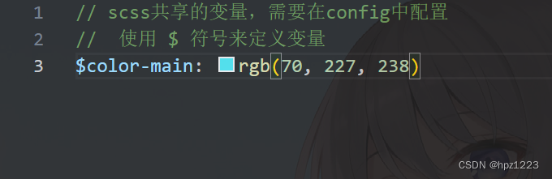
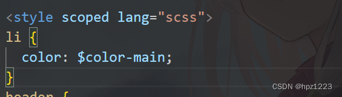

> **參考文章：** [Vue3+Vite中使用SCSS](https://blog.csdn.net/qq_54140719/article/details/136480912)

# 一、安装SCSS

在创建好Vue项目后，在项目路径中打开命令行输入以下命令：

```shell
npm i sass sass-loader --save-dev
```

# 二、使用SCSS

安装完成后便可以在项目中使用SCSS，需要在style标签中设置lang属性为scss如：

```html
<style scoped lang="scss">
```

# 三、配置SCSS全局共享变量

### 1.配置全局

scss 中我们可以自定义变量，一些变量往往是全局共享的，为了方便我们可以在 `vite.config.js` 中 `defineConfig` 里面添加配置如下：

(需要自己新建一个存放共享的变量的文件如：mixin.scss)

```ts
css: {
    // css预处理器
    preprocessorOptions: {
        scss: {
        // 引入 mixin.scss 这样就可以在全局中使用 mixin.scss中预定义的变量了
        // 给导入的路径最后加上 ; 
        additionalData: '@import "@/assets/style/mixin.scss";'
        }
    }
}
```

其中 

`@import "@/assets/style/mixin.scss"; `

为自己定义的 scss 全局变量文件的所在位置，一般我们将他放置在如上的位置，建好文件后我们使用  '$'  来定义变量(这里定义了一个颜色变量)：

```scss
$color-main: rgb(70, 227, 238)
```



然后在项目需要的地方就可以使用：

```scss
li {
  color: $color-main;
}
```



### 2.不配置全局，单独引入

如果不配置则需要单独引入变量所在文件，使用@import

```scss
<style scoped lang="scss">
@import '../../assets/style/mixin.scss'
 
</style>
```